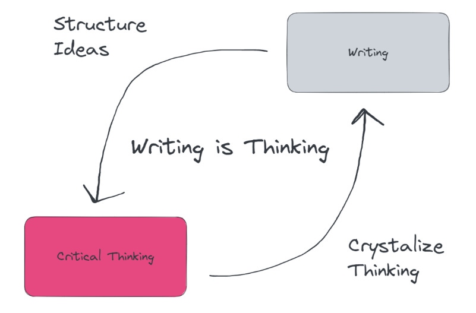

# And so we Meet...

Welcome unknown skibidi person.... welcome to my glorious blog that i don't even know what to blog about. I do this because im bored, but either way i will do this blog that will definitely benefit society by providing valuable information about technology, cloud, AI, Movies, and TV Series.

  

{/* truncate */}

## Introduction

For those people who don't know who i am, my name is **Seno Pamungkas Rahman** and as of this post i'm currently in my final year of computer engineering in Universitas Indonesia. Also currently stressed about the future of my career because i haven't done a lot in my experience or maybe this is just my imposter syndrome doing it's thing. Anyway im an introvert, chill, cool person who likes tinkering with tech, especially in electronics because one of my subject in college. But also still interested in Cloud & AI.

## Why i start a blog?

I was inspired by this friend on mine 'Giga Chad Angga' who have been writing blogs for more than 3 years, [go check out his blog](https://chevonair.com). He is pretty good at describing his ideas and concept in words that are easy for me to understand and he is also very smart. So i need to know why he is so good at writing and describing concepts, this seems like a very useful skill for anybody to have. This skill can be used not just in my field of work but literally anywhere whether it's explaining books, articles, tech, business, movies, etc. It turns out having these skill is all about writing...

### Writing helps thinking

The fact that i have to write makes me sick. Like you feel it in your brain that it's taking all the energy to just create simple and concise words from an idea right? But some people just have the talent to write like it takes no energy at all. Why is this? Perhaps writing it's talent? or is it a skill?

So after extensive research i.e watching 2 educational videos [this](https://www.youtube.com/watch?v=65U5byDZ55M) and [this one](https://www.youtube.com/watch?v=IsQUT9xRYSg&t=99s), it proves that writing helps the vague ideas/concepts we have into a structured and complete idea. Writing helps us find out what we know and what we don't know. Are there holes in your knowledge? or is it in your reasoning? Writing will expose them. That's why my friend is good at explaining stuff because he clearly knows the ideas and not just vaguely.

But the question still remains, can i learn this writing skill or not? The answer is **YES**. The great writer William Zinsser who wrote '[On Writing Well](https://www.amazon.com/Writing-Well-Classic-Guide-Nonfiction/dp/0060891548)' which has sold 1.5 million copies to three generations and he doesn't even like writing. Here's quote from him

> “I don’t like to write, but I take great pleasure in having written—in having finally made an arrangement that has a certain inevitability, like the solution to a mathematical problem. Perhaps in no other line of work is delayed gratification so delayed” - William Zinsser

Even a writer like him doesn't like to write but can still write good concepts. So this must mean that **writing is a skill and we all can learn having this skill**. Which is why we need to practice this skill. [Tim Ferris](https://www.youtube.com/watch?v=65U5byDZ55M) suggest that we _vomit_ and make 2 crappy pages per day. This crappy pages can be worthless and useless but it still helps the brain think more structurally. So it's like a muscle that we have to train everyday. After making crappy pages, we can then revision the pages, make it more clear or have more meaningful topic because writing is re-writing says Tim. To do this, im gonna try to write crappy pages on [Bragdocs](https://www.bragdocs.com), it's just website to quickly put out ideas or concept for me.

## So what am i writing?

Well, to be honest i still don't know but i have some ideas from this guy [Evan Tay](https://evantay.com). He makes blogs like my friend but also do some book reviews, article reviews, explaining concepts like cloud and networking in his documents. This gives me the idea that i can also improve my skills in my field of work by just explaining tech concepts. So i'm going to write about projects that i have been working or cool things i wanna talk about in my blog and explaining cool concepts in my documents. I also gonna rant about movies, tv series, and books that you have to watch.

Here is the what im gonna write if you still don't get it

**Blog** : Projects im working, competitions, or cool problem solutions

**Documents** : Explaining tech concepts like Git, Docker, Linux, Networking, etc. Also doing books, movies, games reviews

## To conclude...

Im pretty new at this, so you probably will see contents that sucks ass but i hope to get better everytime i write. This blog and document will serve me to pour my thoughts and helps me think clearly. I hope you will like it :)

