## A roomba robot 🤔 ???

Do you ever have a roomba that's just keeps crashing into the corner of your room or get stuck where it can't get out? Well i certainly have. I used to have this roomba that is used for cleaning my room but it keeps getting stuck, so i have to pick it up and place it again on the floor. It was supposed to clean my room automatically without me having to place it over and over again. That's why i need a better solution :)

What if we can control the roomba manually? Like if it get stuck, at least we can control remotely to get unstuck. Like what if we used some kind of a controller for the roomba? But also the roomba can still work automatically.

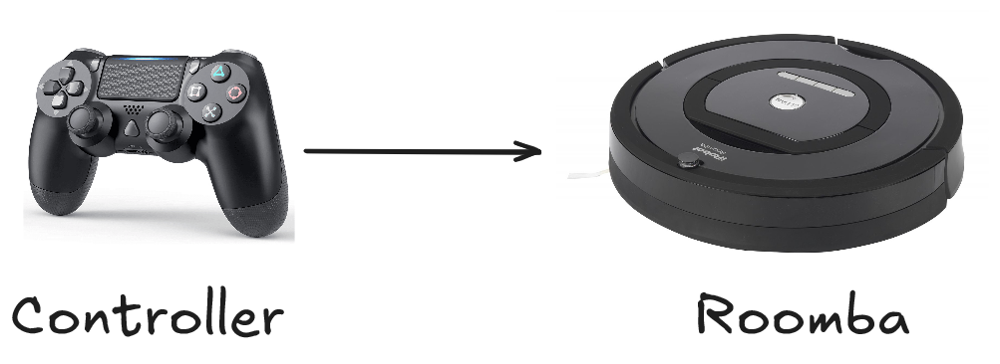

Well that's what me and my team are trying to build for our college project. A simple roomba that can be controlled manually and automatically. We decided that the roomba can be controlled with a PS4 controller. But why stop there? We can have different kind of controllers too right? That's why we also added a hand-gesture controller that is using a gyroscope to control the roomba.

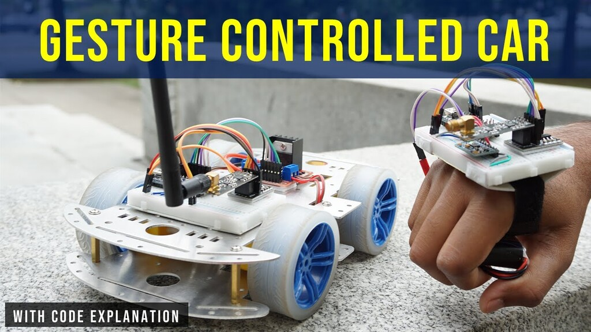

{/* truncate */}

So if we have a roomba that can run automatically and controlled manually using PS4 and Hand-Gestures, how can we control the state of the roomba controllers? For example how can we change from PS4 Controller to Hand-Gestures Controller or from PS4 controller to Automatic? Well we decided a clever way to change the state, that is using a voice command :)

It's like if we say "controller", the roomba will change it state to be controlled with a PS4 controller. If we say "hand", the state will change into hand-gesture controller. Finally if we say "auto" the roomba will change it's state to be automatic.

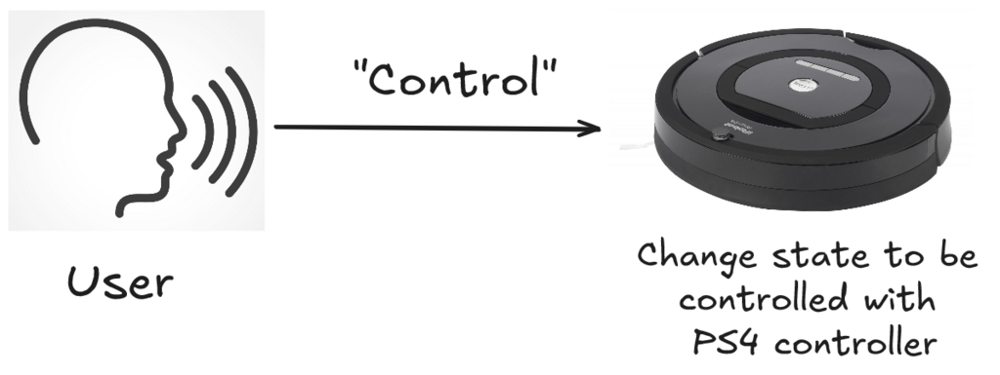

So here are all the list of features for our custom roomba :
- Can still be run automatically
- Can be controlled using PS4 controller
- Can be controlled using hand-gestures
- State management using voice commands
- Vacuum for collecting dusts & trash ( This turns out to be a massive problem :3 )

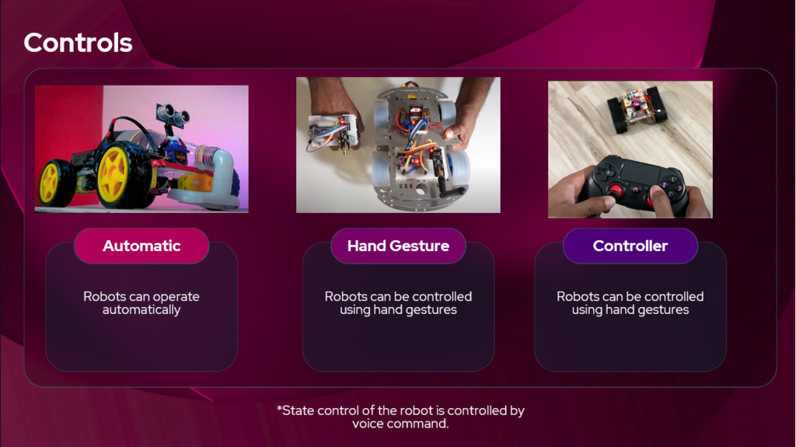

Before we start building this robot, We need a name for the project which we decided to call it Vacuum All-in-One (VAIO) and also i have to give massive credit to my team for helping me build this cool little project for college. Here are the team members :

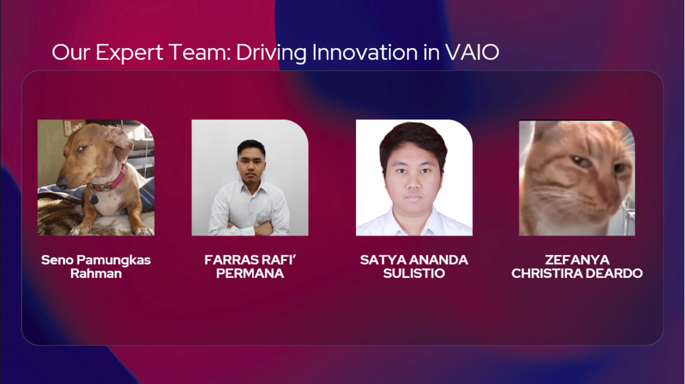

## What tools do we need?

So with all that in mind, how exactly can we build this thing? The concept seems simple enough but ooooh boi it's actually complicated. Like how is the logic going to work with all these different kinds of controllers? First we need to work out tools are we going to use? So we brainstorm the tools we needed

General Purpose:
- Microcontroller to handle the logic and communication (ESP32, Arduino Uno)
- Communication protocol to communicate between 2 microcontrollers (Bluetooth, NRF, Wifi)
- Microphone module for state management using voice commands : INMP441
- Vacuum using fan and a plastic bottle
- DC Gear Motor with Tyre Gear
- Motor Driver for controlling all state of the DC Motors : L298N Motor Driver

Automatic Control:
 - Ultrasonic for detecting object in front of the robot :  HC-SR04
- Servo : SG90

Hand-Gesture Control:
-  Microcontroller to handle the logic for hand-gesture controls & voice commands
 - NRF module to communicate with the other microcontroller
 - Gyroscope module to handle the gesture controls : MPU6050

PS4 Control:
 - PS4 controller that is connected using bluetooth to the microcontroller

Now we need to choose exactly what tools we want. For the microcontroller, we picked ESP32 because it is lightweight and we are more familiar with it. For the communication protocol, we used NRF module because of the references (we later change the communication protocol, which i will explain later).

This all seems complicated even for us, so we made a simple visualization for better understanding

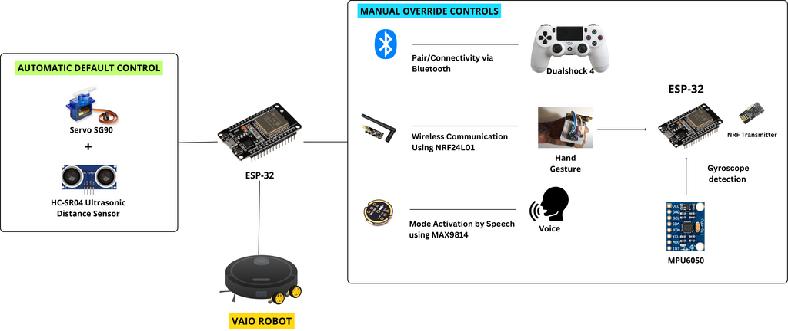

This simple concept laid the foundation for our VAIO robot. Now let's get into the nitty gritty with coding, wiring, and start build this thing!

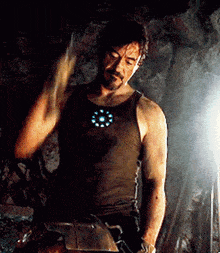

## Code Logic
Now we got the tools we needed, now lets talk about the logic  & code for the 2 microcontrollers. The ESP32 that is attached to the VAIO Robot is called "VAIO Code" and the other one that is attached to the MPU6050 is called "Glove Code".

VAIO Code:
- Handles the state management logic for movement
- Handles the receiving communication for NRF and bluetooth
- Handles the DC Motors & Motor Driver
- Handles the Servo & Ultrasonic for automatic control

Glove Code:
- Handles the NRF communication with the VAIO
- Handles the gyroscope data with MPU6050 module
- Handles the voice data with INMP441 module

Since this is a very large and complex project, we decided to use [PlatformIO](https://platformio.org/https://platformio.org/) to manage all our source code and libraries.  Only using Arduino IDE for managing code and libraries of this complex project can be a pain to the ass. This will turns out to be very collaborative and modular for us to use which in turns we can easily integrate each other codes without a hassle. We also use [FreeRTOS](https://www.freertos.org/) to manage tasks and utilize two cores that ESP32 have, so we can fully utilize the maximum capability of an ESP32.

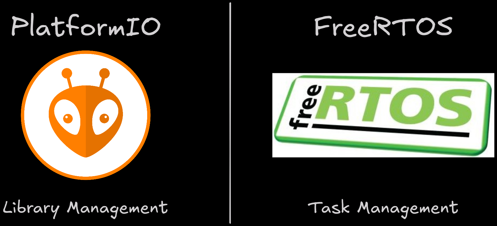

Now that we have the blueprint to start building this, well we can start building it. Each of us are given tasks to focus on building the VAIO
- **Seno (me)** : Building the Glove & Hand Gesture logic using MPU6050 module & NRF communication
- **Farras** : Building the voice command logic using TensorflowLite & Edge-Impulse SDK
- **Satya** : Building the logic for the PS4 controller using bluetooth communication
- **Zefanya** : Building the base prototype for VAIO robot & the automatic movement

## Hand Gesture Logic
Since i have been given the task on the Hand Gesture Logic (i.e. Glove Code), let's focus on that. This should be simple enough because all i needed to do was to use a ESP32 to gather data from the MPU6050 sensor and send the data to another ESP32 using the NRF communication. First off, we need to figure out how we can connect all this hardware components together. We can do that by figuring out what pins we needed to use to connect MPU6050 & NRF component to the ESP32. Let's try to figure how we can connect the MPU6050 first.

### MPU6050 (Gyroscope Module)
MPU6050 module uses a [I2C communication protocols](https://www.circuitbasics.com/basics-of-the-i2c-communication-protocol/) which means we are using the SDA & SCL pins that we need to connect to the default pin for I2C communication in ESP32. According to the [ESP32 pinout reference](https://randomnerdtutorials.com/esp32-pinout-reference-gpios/), the default pin for SDA is GPIO21 and SCL is GPIO22 for the I2C communication protocol in ESP32. So our cables & pins should look something like this

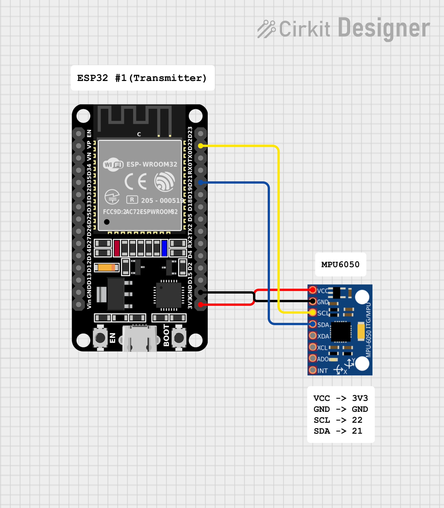
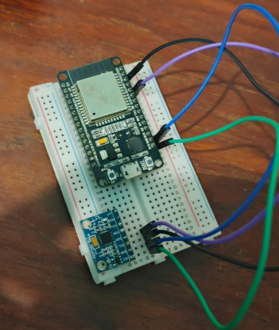

Finally let's get into coding this module. I will be using a libraries such as 'I2Cdev' and 'MPU6050_6Axis_MotionApps20' to handle the complex logic for the I2C communication so we can just grab the necessary data easy and fast.

```cpp
// Libraries for MPU6050
#include "I2Cdev.h"
#include "MPU6050_6Axis_MotionApps20.h"
```

Now we define the necessary variables for the MPU6050.

```cpp
// MPU control/status vars
MPU6050 mpu;
bool dmpReady = false;  // set true if DMP init was successful
uint8_t devStatus;      // return status after each device operation (0 = success, !0 = error)
uint16_t packetSize;    // expected DMP packet size (default is 42 bytes)
uint8_t fifoBuffer[64]; // FIFO storage buffer
Quaternion q;           // [w, x, y, z]         quaternion container
VectorFloat gravity;    // [x, y, z]            gravity vector
float ypr[3];           // [yaw, pitch, roll]   yaw/pitch/roll container and gravity vector
```

Also we need to define the data structure for the gyroscope data. In our VAIO robot, we only needed the x and y value to move left/right/up/down for the robot. We can just send a value between 0 - 254, so we only need 8 bits for that. Therefore we define unsigned integer of 8 bits.

```cpp
struct gyroSensor_Data
{
  uint8_t xAxisValue;
  uint8_t yAxisValue;
} data;
```


To initialize the MPU6050, we just simply call the initialize function.
```cpp
  mpu.initialize();
```

Although in the final code, there is more error checking and validation to make sure the I2C communication protocol works properly. You can check the [code on our github repo](https://github.com/VAIO-CE/VAIO-Code/blob/b5742e10f9563abe55becef320b093efea5c9760/Glove_Code/lib/setup/setup.cpp#L33-L110).

To get the data from MPU650, we need to make sure we get the latest data using the `mpu.dmpGetCurrentFIFOPacket()` function which takes an argument for our buffer. We just need to loop forever to keep getting the MPU6050 data. Now we only need to get the x and y value which means we only needed to call the `mpu.dmpGetYawPitchRoll()` function. Note that we don't need Quarternion or gravity because we don't actually need it.

I also map and constrain the x and y value into 0 - 254 integer to make sure we get the correct data structure.

```cpp
while(1){

    // if programming failed, don't try to do anything
    if (!dmpReady) return;

    // read a packet from FIFO. Get the Latest packet
    if (mpu.dmpGetCurrentFIFOPacket(fifoBuffer))
    {
      // display Euler angles in degrees
      mpu.dmpGetQuaternion(&q, fifoBuffer);
      mpu.dmpGetGravity(&gravity, &q);
      mpu.dmpGetYawPitchRoll(ypr, &q, &gravity);

      int xAxisValue = constrain(ypr[2] * 180/M_PI, -90, 90);
      int yAxisValue = constrain(ypr[1] * 180/M_PI, -90, 90);

      gyroSensor_Data.xAxisValue = map(xAxisValue, -90, 90, 0, 254);
      gyroSensor_Data.yAxisValue = map(yAxisValue, -90, 90, 254, 0);
    }

}
```


Now before we loop again we need to make sure we clear the FIFO buffer so we don't get the same value again.

```cpp
while(1){
    if (mpu.dmpGetCurrentFIFOPacket(fifoBuffer))
    {
        /*
         *
         * Previous Code
         *
         *
        */

        // Clear FIFO buffer
        mpu.resetFIFO();
    }
}
```

This is essentially the code to get the MPU6050 data, we now should get the x and y value accurately from the gyroscope module.

### The NRF Module does not work 😐
After getting the MPU6050 data, the next goal is to send the data to the other ESP32 using NRF module. **But there is a problem...**


The NRF module that we bought is **not compatible with our ESP32** which means they can't communicate with each other 🥲. This NRF module only works with arduino boards. I should have thought about compability before buying this hardware and not just assume it will just work on any boards 😖.

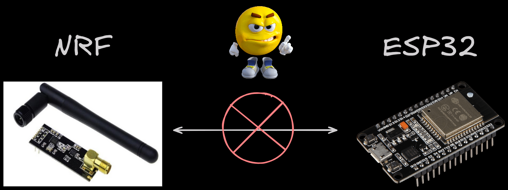

This is really problematic. How can we send the hand-gesture data (i.e. MPU6050) to the ESP32 on the VAIO robot now? We might need to buy different NRF hardware just to make it work. I really don't want to waste anymore money and buying another hardware hoping it will work. This makes me sad bro 😭


But as an computer engineer student, we can't just give up. It's just not in our DNA. We must find a solution, **we must find another way**.

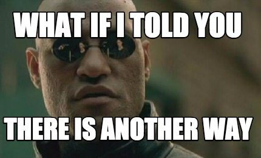

### ESP-NOW - The Boy Savior
To solve this problem, we needed to find an alternative solution for our wireless communication protocol. This can be in the form of bluetooth, WIFI, or NRF (which didn't worked). So our only choice is either bluetooth or WIFI, let's get the pros and cons of each solution for our VAIO project.

Pros :
- Bluetooth : This is a TCP connection means it's a reliable connection, good at close range.
- WIFI : also TCP connection which means reliable connection, good at close-medium range.

Cons :
- Bluetooth : We cannot use bluetooth because it is already being used for the PS4 controller. This will cause conflict and ESP32 Transmitter will need to keep reconnecting between PS4 controller and ESP32 Receiver.
- WIFI : This is a TCP connection which means it has connect first and do handshake everytime. **We wanted a fast data transfer and not keep reconnecting everytime which means we needed a UDP protocol for connectionless data transfer.**


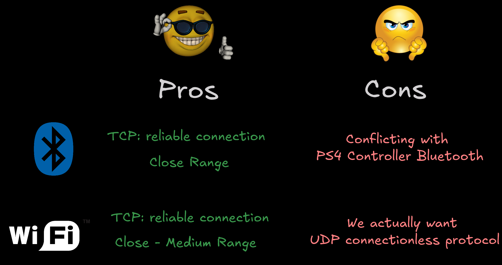

This seems all hope is lost... There seems to be no solution for our project unless we buy another NRF module that is compatible with ESP32.

But wait... There is hope.... The saviour... The boy savior... (a reference to [Arcane](https://www.imdb.com/title/tt11126994/) btw)

Introducing [ESP-NOW](https://www.espressif.com/en/solutions/low-power-solutions/esp-now), a wireless connectionless protocol that uses the WIFI hardware but uses a custom protocol made by Expressif themself.


It is fast, low power usage, have a long range (up to 100m). This protocol doesn't use the standard OSI model for network, instead it uses a custom ESP-NOW model. It reduces 5 layer OSI model into just one layer, this causes to have quick response in data transfer.

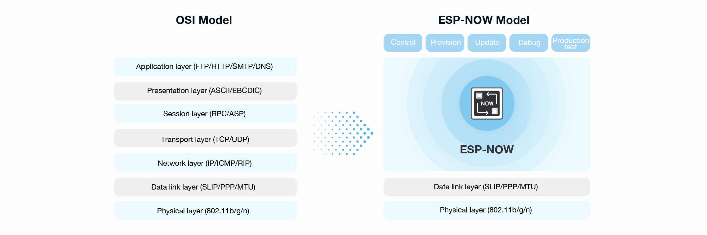

This wireless communication protocol is the best solution for our problem. ESP-NOW has these characteristic which is why it fits our solution :
- It is connectionless which means we don't need to do a TCP handshake. (ESP-NOW acts like a UDP but still different)
- It is fast and not slow
- It has a range up to 100m (Though we only need the range to be around 30-50m, which is still very good)

Now, let's just implement this ESP-NOW protocol. To use this protocol, we actually need the MAC address of the ESP32's. We use this [guide](https://randomnerdtutorials.com/get-change-esp32-esp8266-mac-address-arduino/) to get our MAC addresses for ESP32.

When using ESP-NOW, we need to set the WIFI mode into station. Then we call `esp_now_init()` to initialize the ESP-NOW protocol. After that is sucessful, we set callback function for transmitting data using the `esp_now_register_send_cb()` function (Note you can also set callback function when receiving data). Finally we can add 'peers' which essentially means our other ESP32 MAC addresses. In this code, I put my receiving ESP32 MAC addresss into the broadcastAddress variable. Now can just call `esp_now_add_peer()` function. This is it for setting up ESP-NOW communication protocol.

```cpp
void setupESPNOW(){
  // Set device as a Wi-Fi Station
  WiFi.mode(WIFI_STA);

  // Init ESP-NOW
  if (esp_now_init() != ESP_OK) {
    Serial.println("Error initializing ESP-NOW");
    return;
  }

  // Once ESPNow is successfully Init, we will register for Send CB to
  // get the status of Trasnmitted packet
  esp_now_register_send_cb(OnDataSent);

  // Register peer
  memcpy(peerInfo.peer_addr, broadcastAddress, 6);
  peerInfo.channel = 0;
  peerInfo.encrypt = false;

  // Add peer
  if (esp_now_add_peer(&peerInfo) != ESP_OK){
    Serial.println("Failed to add peer");
    return;
  }

}
```

Ok we have set a callback function and add peers to our esp-now protocol but how can we send the gyroscope data? Like what function do i call?

Well we can call the `esp_now_send(address, data, data_size)` function which we wil provide the argument for the ESP32 MAC address and the data.

```cpp
esp_err_t result = esp_now_send(broadcastAddress, (uint8_t *) &data, sizeof(data));

if (result == ESP_OK) {
    Serial.println("Sent with success");
}
```

Now that we can send data using ESP-NOW but how can we receive it? We just need to simply set the callback function on the receiver side with this function

```cpp
esp_now_register_recv_cb(esp_now_recv_cb_t(OnDataRecv));
```
Note we need to set the same data structure of the receiver side too, we then copy the memory from incoming data into this receiver data structure so we can read the actual value.
```cpp
struct PacketData
{
  uint8_t xAxisValue;
  uint8_t yAxisValue;
} receiverData;
```
```cpp
void OnDataRecv(const uint8_t * mac, const uint8_t *incomingData, int len) {
  memcpy(&receiverData, incomingData, sizeof(receiverData));
  Serial.printf("X : %d , Y : %d\n", receiverData.xAxisValue, receiverData.yAxisValue);
}
```

This callback function will be called everytime there is a data receive targeted at the MAC address of the ESP32. This doesn't require any ACK signals and just receive the data from whomever sent it.

Now it works, we can finally get the gyroscope data from other ESP32 using the ESP-NOW communication protocol

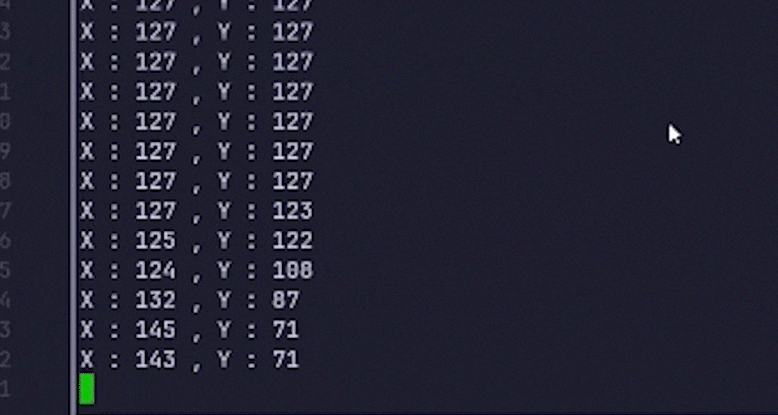

In the next part, we will explore more on how can we utilize PlatformIO to make this code more modular and apply OOP principles. We will also implement task using FreeRTOS as well.
