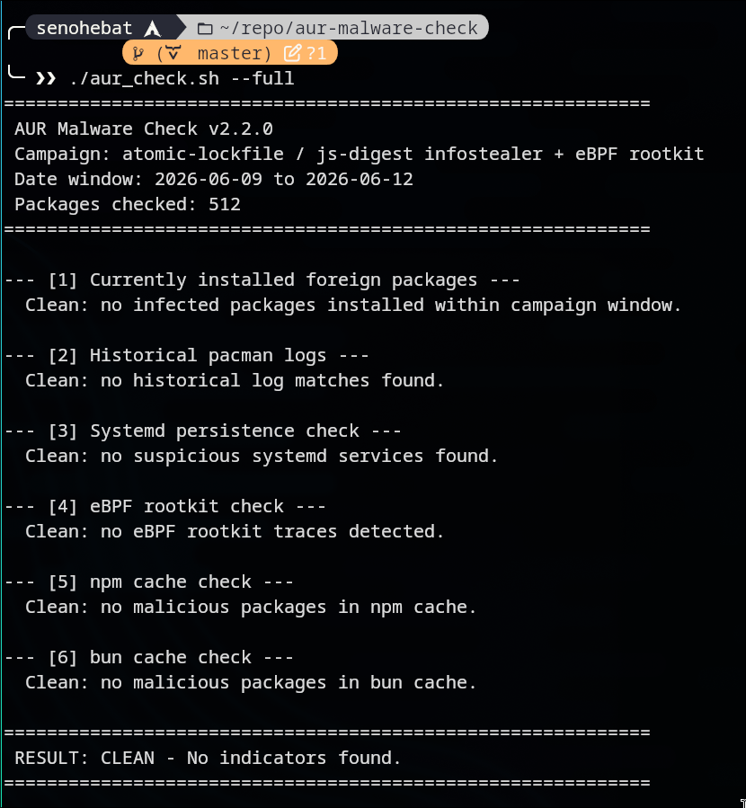

## Context

A couple of days ago, there was this massive [supply chain attacks that's happening in AUR packages](https://www.sonatype.com/blog/atomic-arch-npm-campaign-adds-malicious-dependency) and unfortunately I'm using Arch linux hence sometimes i like to download some stuff from AUR packages 😅. Which is why i was scared because i was one of their supply chain targets.

This malware seems to have hijacked over [1500+ AUR Packages](https://www.privacyguides.org/news/2026/06/12/around-1-500-aur-packages-compromised-with-rootkit-like-malware/). It targets AUR projects that have been mostly abandoned by the maintainers where these bad actors will modify the PKGBUILD and install a malicious npm package called `atomic-lockfile`. This seems like a big supply chain attack where i don't think im safe this time. Hence, i need to check whether im safe or not.

For you boomers who don't know about AUR packages, it's basically like a public package repositories where **ANY user** can produce **ANY CONTENT** they want. Which meaaaaaannnss, these produced packages can sometimes contains virus or malware from bad actors.

So everytime you install these packages from AUR, you always have the risk of getting a malware or virus. This differs from the [official Arch Linux repository](https://wiki.archlinux.org/title/Official_repositories) where all the packages are verified first before you are able to download and install it.

## But did i get infected?

Well funny thing is i rarely update my Arch linux packages, especially the AUR packages lmao. However i did still get paranoid and scared that i might actually be infected with this [rootkit malware](https://www.sonatype.com/blog/atomic-arch-npm-campaign-adds-malicious-dependency).

Luckily, i found a [repository that checks whether i have the malware or not](https://github.com/lenucksi/aur-malware-check) (i think the script in that repo is safe guys 😏). The script will check your current installed packages in the system and your pacman logs to see whether or not your system is infected. In addition, it also checks your npm and bun cache and even your systemd processes.

See guys, im safe bro. So the moral of the story is to just don't update your system if you are using Arch Linux.

## Advice for Arch Linux Users

1. Please be careful install packages from AUR. Check if it's still being maintained or not.
1. Bro you don't need to upgrade your system everytime there is an update. Updating / Upgrading in arch linux now barely breaks again (which is a good thing) but you don't need to update if there is no need for it. (This isn't Windows guys where you are forced to update).
